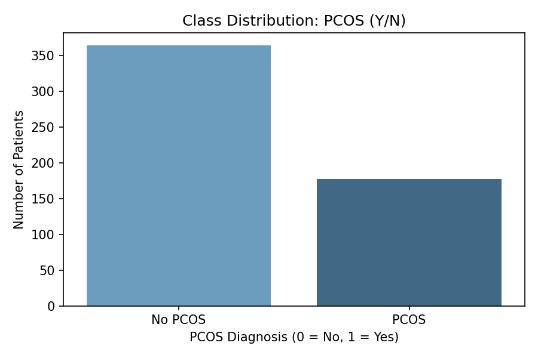
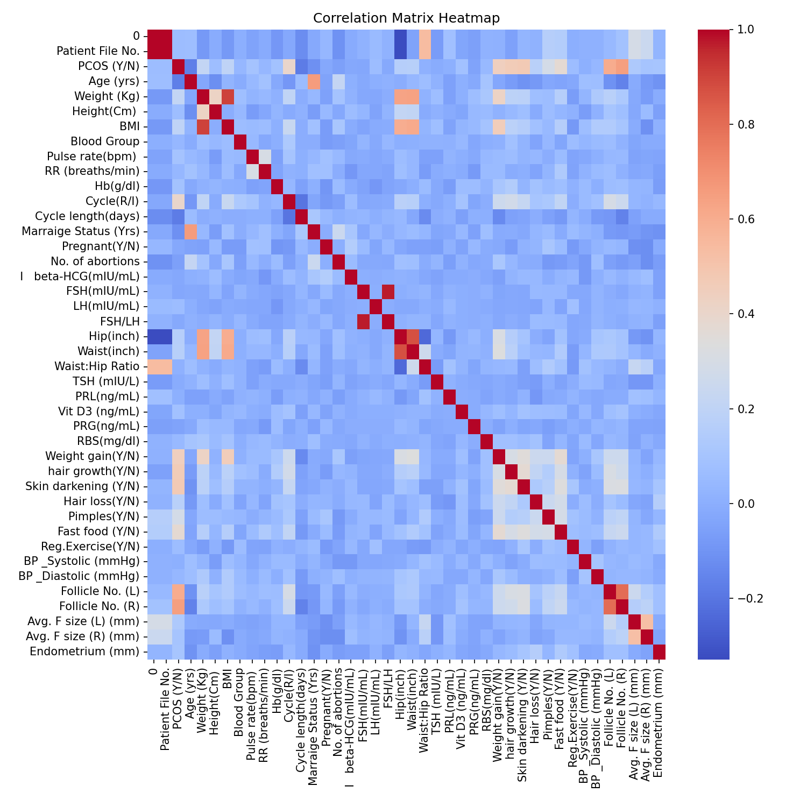
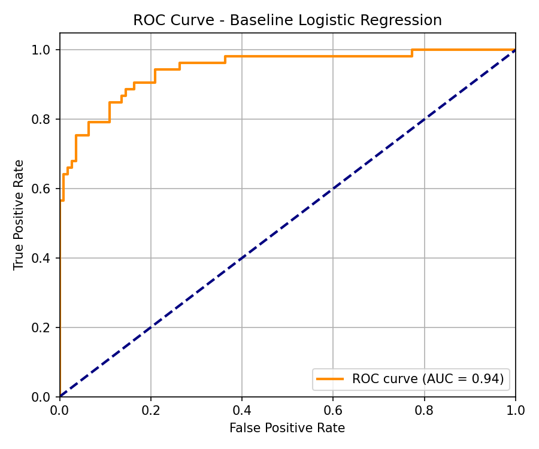
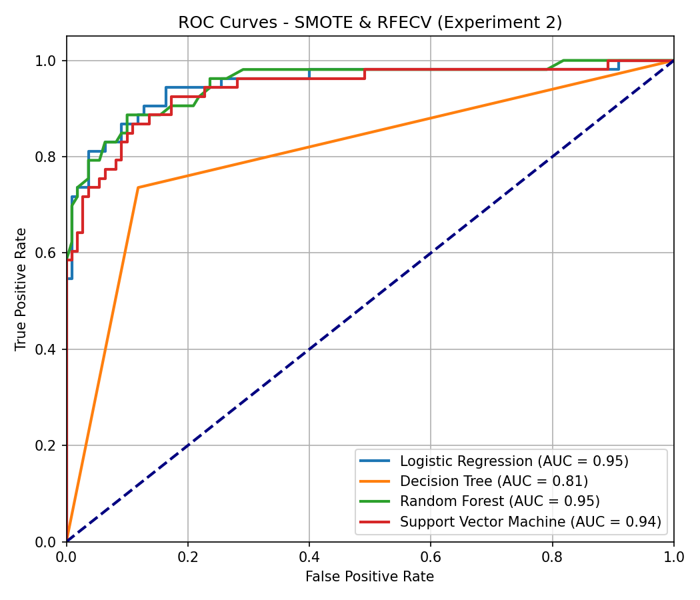
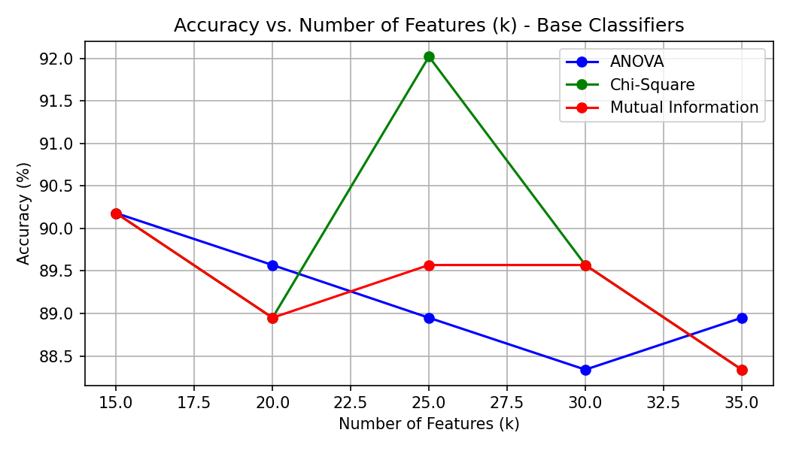

# PCOS Prediction Model 

This repository contains a machine learning pipeline designed to analyze clinical patient data and predict **Polycystic Ovary Syndrome (PCOS)**. It brings together data preprocessing, exploratory analysis, feature selection techniques, balancing, hyperparameter tuning, and advanced ensembles (such as XGBoost, CatBoost, and AdaBoost) in a sequential, clean, and robust workflow.

---

## Overview of Combined Workflow

1. **Setup & Package Installations**: Optional installations for running in Google Colab or local setups.
2. **Library Imports**: Loading all standard machine learning, scaling, and visualization packages (gracefully handles optional boosting installations).
3. **Data Loading**: Robust script checking for local CSV first, then falling back to Google Drive/Colab.
4. **Data Preprocessing & Cleaning**: Handling object-to-numeric type conversions and clean-up of empty rows.
5. **Exploratory Data Analysis (EDA)**: Class imbalance plot, Age/Weight/Height distributions, and correlation heatmap.
6. **Feature Selection (SelectKBest)**: Selecting features using Chi-Square and Mutual Information.
7. **Experiment 1**: Baseline Classifiers (Logistic Regression, Decision Tree, Random Forest, SVC) with selected features.
8. **Experiment 2**: SMOTE & RFECV (Recursive Feature Elimination with Cross-Validation).
9. **Experiment 3**: Hyperparameter Tuning (GridSearchCV) on standard classifiers.
10. **Experiment 4**: Advanced Ensemble and Boosting Models (AdaBoost, Bagging, XGBoost, CatBoost).
11. **Performance Visualizations**: Accuracy vs Number of Features (k) charts.

---

## Visualizations & Exploratory Analysis

### Class Distribution (Imbalance Check)
The dataset shows a class imbalance between patients diagnosed with PCOS and those without. This is resolved in the experiments using **SMOTE** oversampling.


### Feature Correlations
Correlation matrix checking linear relationships between patient features and diagnosis.


---

## Key Experimental Results & ROC Curves

### 1. Baseline Model ROC Curve (Experiment 1)
Evaluates standard models on raw features selected via Chi-Square (k=25).


### 2. SMOTE & RFECV Model ROC Curves (Experiment 2)
By balancing the training set using SMOTE and applying Recursive Feature Elimination (RFECV), models achieve significantly improved, smooth ROC curves and higher classification confidence (AUC).


### 3. Feature Selection Sensitivity (k vs. Accuracy)
Tracing model performance across different feature counts (`k = 15, 20, 25, 30, 35`) and feature selection methods (ANOVA, Chi-Square, and Mutual Information).


---

## Getting Started

### Prerequisites
Make sure you have python 3.8+ and the following packages installed:
```bash
pip install pandas numpy scikit-learn matplotlib seaborn imbalanced-learn xgboost catboost
```

### Running the Project
1. Download the repository and place the clinical dataset `PCOS_data.csv` in the root folder.
2. Open the main pipeline file `PCOS_Prediction_Model.ipynb` in Jupyter Notebook, JupyterLab, or Google Colab.
3. Run the cells sequentially to perform the data analysis and train the prediction models.

# PCOS-Prediction
Predictive PCOS Model

